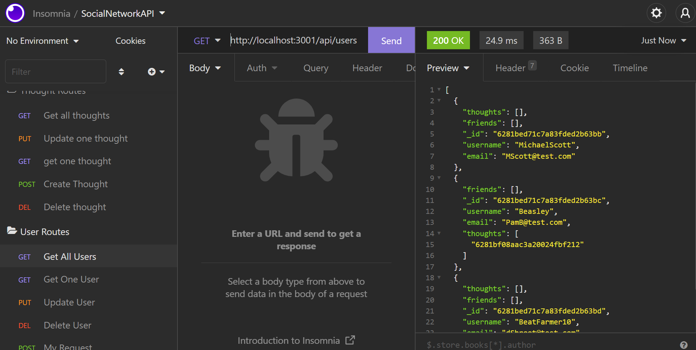

  # Social Network API Backend

<!--  -->

## Link to Functional Video
[Video going throught the routes.](https://watch.screencastify.com/v/bxMRhtATdvgicqFHABQo)

## Badges

## Description

The backend setup for a simple Social Networking site. Users will be able to create a list of friends. They will be able to post messages called thoughts, and react to thoughts.

## Table of Contents

- [Badges](#Badges)
- [Installation](#installation)
- [Usage](#usage)
- [Credits](#credits)
- [License](#license)
- [Tests](#tests)

## Installation

- npm i to get dependencies. Run server and use Insomnia to check routes.
- npm run seed will seed the database with some users.

## Usage

- Use pre-built Insomnia routes to add/update/delete messages, reactions, and friends.

## Credits

- [powe0186](https://github.com/powe0186)

## License

### MIT

    MIT License:
    A short and simple permissive license with conditions only requiring preservation
    of copyright and license notices. Licensed works, modifications, and larger works
    may be distributed under different terms and without source code.

[CLICK FOR MORE ABOUT LICENSE](https://choosealicense.com/licenses/mit/)

## Tests

## My Github & Email

- [https://github.com/powe0186](https://github.com/powe0186)
- [powe0186@gmail.com](mailto:powe0186@gmail.com)

